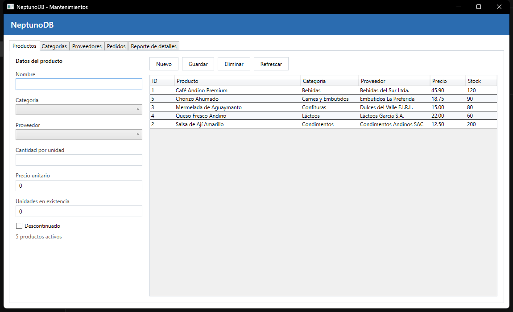
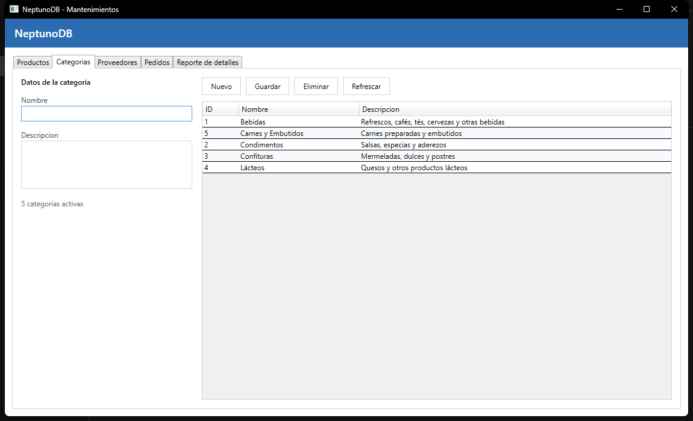
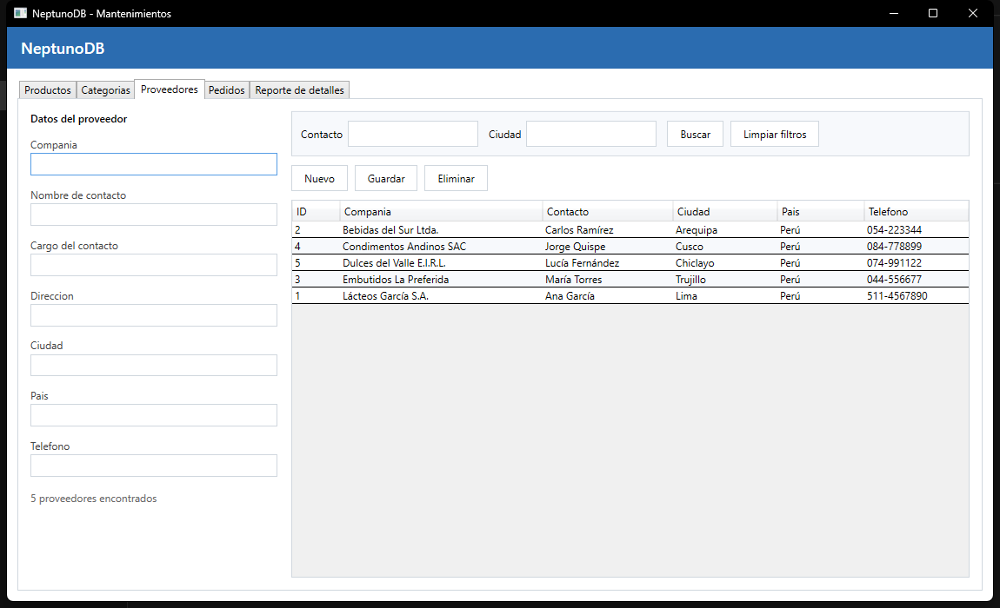
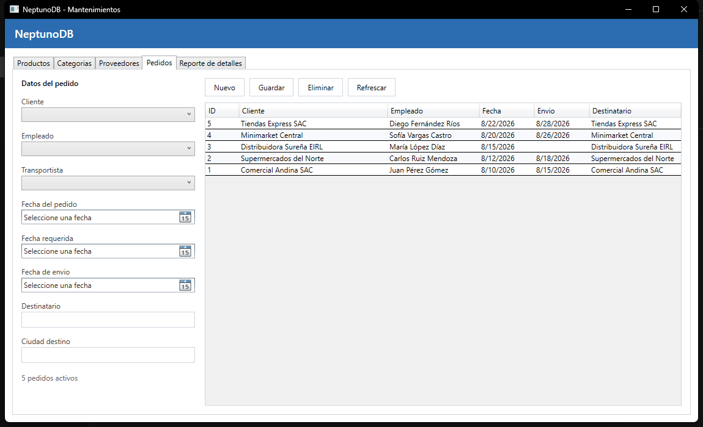
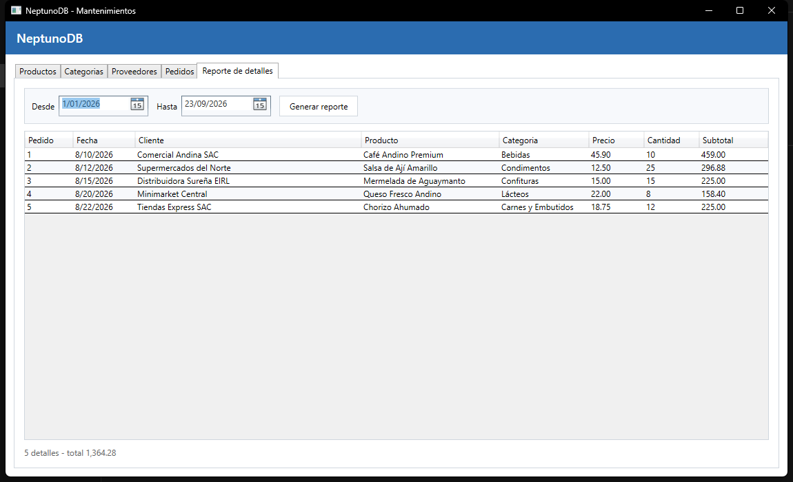

# Laboratorio 06 - Class Library & DataSet (NeptunoDB)

Mantenimiento de Productos, Categorias, Proveedores y Pedidos sobre SQL Server con WPF y
ADO.NET, con eliminacion logica y la capa de datos separada en una biblioteca de clases.

## Estructura de la solucion

```
lab06/
├── Neptuno.sln
├── Database/
│   ├── 01_NeptunoDB.sql          tablas y datos base
│   ├── 02_EliminacionLogica.sql  columna Activo BIT DEFAULT 1
│   └── 03_Procedimientos.sql     procedimientos almacenados
├── Neptuno.Datos/                biblioteca de clases (punto 13)
│   ├── Conexion.cs
│   ├── Modelos/                  Categoria, Proveedor, Producto, Pedido
│   └── Repositorios/             acceso a datos con ADO.NET
├── Neptuno.App/                  proyecto de inicio WPF
│   ├── App.config                cadena de conexion (punto 15)
│   ├── MainWindow.xaml
│   └── Vistas/                   Productos, Categorias, Proveedores, Pedidos, Reporte
└── Capturas/
```

`Neptuno.App` referencia a `Neptuno.Datos` mediante referencia de proyecto; la biblioteca no
conoce nada de WPF.

## Base de datos

Ejecutar los scripts en orden desde SSMS o sqlcmd:

```bash
sqlcmd -S .\SQLEXPRESS -E -C -i Database\01_NeptunoDB.sql -i Database\02_EliminacionLogica.sql -i Database\03_Procedimientos.sql
```

El script 02 agrega `Activo BIT NOT NULL DEFAULT 1` a Productos, Categorias, Proveedores y
Pedidos, mas un indice por ese campo.

## Procedimientos almacenados

| Entidad | Procedimientos |
|---|---|
| Categorias | `usp_CategoriasListar`, `usp_CategoriaObtener`, `usp_CategoriaInsertar`, `usp_CategoriaActualizar`, `usp_CategoriaEliminar` |
| Proveedores | `usp_ProveedoresListar`, `usp_ProveedorObtener`, `usp_ProveedorInsertar`, `usp_ProveedorActualizar`, `usp_ProveedorEliminar`, `usp_ProveedoresBuscar` |
| Productos | `usp_ProductosListar`, `usp_ProductoObtener`, `usp_ProductoInsertar`, `usp_ProductoActualizar`, `usp_ProductoEliminar` |
| Pedidos | `usp_PedidosListar`, `usp_PedidoObtener`, `usp_PedidoInsertar`, `usp_PedidoActualizar`, `usp_PedidoEliminar` |
| Reporte | `usp_DetallePedidosPorFechas` |

Los cuatro `*Eliminar` hacen `UPDATE ... SET Activo = 0`; no existe ningun `DELETE` en la
solucion. Todos los listados filtran `Activo = 1`, incluidos `usp_ProveedoresBuscar` (punto 7)
y `usp_DetallePedidosPorFechas`, que ademas hace `INNER JOIN` con Pedidos y filtra por
intervalo de fechas (punto 8).

## Criterio del escenario desconectado

El criterio fue **separar las lecturas de las escrituras**:

- **Lecturas: modo desconectado.** Los listados, los combos y el reporte se resuelven con
  `SqlDataAdapter.Fill` sobre un `DataTable` (o un `DataSet` en el reporte, que puede crecer a
  varias tablas). El adaptador abre la conexion, llena la estructura en memoria y la cierra de
  inmediato; la ventana trabaja contra esa copia local. Es lo que corresponde aqui porque son
  consultas que alimentan grillas de solo lectura: se muestran, se recorren y se ordenan sin
  necesidad de mantener la conexion ni un `SqlDataReader` abierto mientras el usuario mira la
  pantalla.
- **Escrituras: modo conectado puntual.** Insertar, actualizar y eliminar (baja logica) usan
  `SqlCommand.ExecuteNonQueryAsync` contra el procedimiento almacenado correspondiente. Son
  operaciones cortas, unitarias y validadas en el servidor; usar `DataAdapter.Update` con un
  `CommandBuilder` habria significado enviar cambios generados automaticamente en vez de los
  procedimientos exigidos por el enunciado.
- Despues de cada escritura se vuelve a llamar al listado para refrescar la copia en memoria;
  asi la grilla nunca queda desfasada respecto de la base de datos.

## Auditoria: App.config (punto 15)

La cadena de conexion no puede vivir en la biblioteca de clases: `ConfigurationManager` lee el
archivo de configuracion del **ejecutable de inicio**, no el de la DLL. Por eso
`Neptuno.App/App.config` contiene:

```xml
<connectionStrings>
  <add name="NeptunoDB"
       connectionString="Server=.\SQLEXPRESS;Database=NeptunoDB;Trusted_Connection=True;TrustServerCertificate=True"
       providerName="Microsoft.Data.SqlClient" />
</connectionStrings>
```

y `Neptuno.Datos/Conexion.cs` solo la resuelve en tiempo de ejecucion:

```csharp
public static string Cadena =>
    ConfigurationManager.ConnectionStrings["NeptunoDB"].ConnectionString;
```

Al compilar, el archivo se copia como `Neptuno.App.dll.config` junto al ejecutable, que es
donde `ConfigurationManager` lo busca.

## Auditoria: carga asincrona (punto 16)

Ninguna llamada usa `.Result` ni `.Wait()`. La cadena es asincrona de punta a punta:

```
private async void ProductosView_Loaded(...)  ->  await CargarAsync()
    -> await repositorio.ListarAsync()  ->  Task.Run(adaptador.Fill)
private async void Guardar_Click(...)  ->  await repositorio.InsertarAsync(...)
    -> await cn.OpenAsync() / await cmd.ExecuteNonQueryAsync()
```

Los manejadores de eventos son `async void` (unico caso donde se justifica) y todos los
metodos intermedios devuelven `Task`, de modo que la ventana nunca se bloquea mientras se
consulta la base de datos.

## Capturas

| Vista | Captura |
|---|---|
| Productos |  |
| Categorias |  |
| Proveedores con filtros de busqueda |  |
| Pedidos |  |
| Reporte por intervalo de fechas |  |

## Ejecucion

```bash
dotnet run --project Neptuno.App
```

## Observaciones

- La eliminacion logica se resuelve integramente en el servidor: la aplicacion solo invoca el
  procedimiento de baja y vuelve a listar, por lo que no hay riesgo de que un `DELETE` se
  escape desde la interfaz.
- Las claves foraneas de `DetallePedidos` siguen siendo validas despues de una baja, porque la
  fila nunca se borra; el historial se conserva y solo deja de aparecer en los listados.
- Clientes, Empleados y Transportistas no forman parte del enunciado, por eso no tienen campo
  `Activo` y se consultan con SQL directo para alimentar los combos de pedidos.
- Los filtros de proveedores y las fechas del reporte viajan como parametros opcionales al
  procedimiento, no se arman concatenando cadenas.

## Conclusiones

- Separar los modelos y los repositorios en una biblioteca de clases deja el proyecto WPF solo
  con interfaz; la misma capa de datos podria reutilizarse desde una consola o una API sin
  tocar una linea.
- El modo desconectado es el adecuado para mostrar informacion y el conectado para modificarla:
  mezclarlos sin criterio termina en conexiones abiertas de mas o en cambios enviados sin pasar
  por los procedimientos almacenados.
- La configuracion pertenece al proyecto de inicio, no a la biblioteca, porque
  `ConfigurationManager` resuelve rutas respecto del ejecutable.
- Usar `async/await` en toda la cadena mantiene la ventana respondiendo; basta un `.Result`
  intermedio para perder esa ventaja y arriesgar un interbloqueo.
