# Laboratorio 6 - NeptunoDB con WPF y ADO .NET

Mantenimiento de Productos, Categorias, Proveedores y Pedidos sobre la base de datos
NeptunoDB, con **eliminacion logica** en lugar de borrado fisico. Toda la escritura se
hace con `ExecuteNonQuery()` sobre procedimientos almacenados.

---

## 1. Estructura del proyecto

```
lab6/
├── Database/
│   ├── 01_NeptunoDB.sql            Base de datos, tablas y datos de prueba
│   ├── 02_EliminacionLogica.sql    Campo Activo BIT DEFAULT 1 + indices
│   └── 03_Procedimientos.sql       22 procedimientos almacenados
├── Models/                         Clases de dominio (Producto, Pedido, ...)
├── Data/                           Capa ADO .NET (un repositorio por entidad)
├── ViewModels/                     Logica de presentacion (MVVM)
├── Views/                          Ventana principal y las 5 vistas
├── Styles/Estilos.xaml             Estilos compartidos
└── Capturas/                       Evidencia de las pruebas
```

## 2. Como ejecutarlo

Ejecutar los tres scripts **en orden** sobre SQL Server:

```bash
sqlcmd -S ".\SQLEXPRESS" -E -C -f 65001 -i Database/01_NeptunoDB.sql
```

```bash
sqlcmd -S ".\SQLEXPRESS" -E -C -f 65001 -i Database/02_EliminacionLogica.sql
```

```bash
sqlcmd -S ".\SQLEXPRESS" -E -C -f 65001 -i Database/03_Procedimientos.sql
```

Y luego levantar la aplicacion:

```bash
dotnet run
```

La cadena de conexion esta en [Conexion.cs](Data/Conexion.cs) y apunta a
`.\SQLEXPRESS` con autenticacion de Windows.

---

## 3. Punto 2 - El campo de estado

[02_EliminacionLogica.sql](Database/02_EliminacionLogica.sql) agrega la misma columna
a las cuatro tablas del enunciado:

```sql
ALTER TABLE dbo.Productos
    ADD Activo BIT NOT NULL CONSTRAINT DF_Productos_Activo DEFAULT (1);
```

| Tabla | Columna | Tipo | Valor por defecto |
|---|---|---|---|
| Categorias | Activo | BIT NOT NULL | 1 |
| Proveedores | Activo | BIT NOT NULL | 1 |
| Productos | Activo | BIT NOT NULL | 1 |
| Pedidos | Activo | BIT NOT NULL | 1 |

`Activo = 1` es un registro vigente y `Activo = 0` un registro dado de baja. El script
es idempotente (`IF COL_LENGTH(...) IS NULL`), asi que se puede volver a ejecutar sin
romper nada, y crea un indice sobre `Activo` en cada tabla porque **todos** los listados
consultan por esa columna.

## 4. Procedimientos almacenados

| Entidad | Listar | Obtener | Insertar | Actualizar | Eliminar (logico) |
|---|---|---|---|---|---|
| Categorias | `usp_CategoriasListar` | `usp_CategoriaObtener` | `usp_CategoriaInsertar` | `usp_CategoriaActualizar` | `usp_CategoriaEliminar` |
| Proveedores | `usp_ProveedoresListar` | `usp_ProveedorObtener` | `usp_ProveedorInsertar` | `usp_ProveedorActualizar` | `usp_ProveedorEliminar` |
| Productos | `usp_ProductosListar` | `usp_ProductoObtener` | `usp_ProductoInsertar` | `usp_ProductoActualizar` | `usp_ProductoEliminar` |
| Pedidos | `usp_PedidosListar` | `usp_PedidoObtener` | `usp_PedidoInsertar` | `usp_PedidoActualizar` | `usp_PedidoEliminar` |

Mas los dos consultas del enunciado:

- **Punto 7** - `usp_ProveedoresBuscar(@NombreContacto, @Ciudad)`: busqueda parcial por
  los dos campos. Ambos parametros son opcionales; si uno llega vacio o `NULL` ese
  filtro simplemente no se aplica.
- **Punto 8** - `usp_DetallePedidosPorFechas(@FechaInicio, @FechaFin)`: `INNER JOIN`
  entre `DetallePedidos` y `Pedidos`, acotado por el intervalo y con `pe.Activo = 1`.

---

## 5. Como se implemento `ExecuteNonQuery`

Cada repositorio de [Data/](Data) expone `Insertar`, `Actualizar` y `Eliminar`, y las
tres usan el mismo patron: `SqlCommand` con `CommandType.StoredProcedure`, parametros
tipados y **una sola llamada a `ExecuteNonQuery()`**, cuyo valor de retorno es la
cantidad de filas afectadas.

### Insertar

El procedimiento declara un parametro de salida `@NuevoID`, de modo que el alta devuelve
el identificador generado sin necesidad de una segunda consulta:

```csharp
public int Insertar(Producto producto)
{
    using (var cn = new SqlConnection(Conexion.Cadena))
    using (var cmd = new SqlCommand("dbo.usp_ProductoInsertar", cn))
    {
        cmd.CommandType = CommandType.StoredProcedure;
        Cargar(cmd, producto);

        var nuevoId = new SqlParameter("@NuevoID", SqlDbType.Int)
        {
            Direction = ParameterDirection.Output
        };
        cmd.Parameters.Add(nuevoId);

        cn.Open();
        var filas = cmd.ExecuteNonQuery();      // INSERT

        if (nuevoId.Value != DBNull.Value) producto.ProductoID = (int)nuevoId.Value;
        return filas;
    }
}
```

### Actualizar

```csharp
cmd.Parameters.AddWithValue("@ProductoID", producto.ProductoID);
Cargar(cmd, producto);

cn.Open();
return cmd.ExecuteNonQuery();                   // UPDATE
```

### Eliminar (baja logica)

```csharp
cmd.CommandType = CommandType.StoredProcedure;
cmd.Parameters.AddWithValue("@ProductoID", productoId);

cn.Open();
return cmd.ExecuteNonQuery();                   // UPDATE ... SET Activo = 0
```

El boton **Eliminar** de la interfaz llama exactamente a este metodo. No hay ninguna
sentencia `DELETE` en la aplicacion.

### Detalle importante sobre `SET NOCOUNT`

Los procedimientos de **lectura** usan `SET NOCOUNT ON`, pero los de **escritura** no lo
hacen a proposito. Con `SET NOCOUNT ON` activo, `ExecuteNonQuery()` devuelve `-1` y se
pierde la informacion de cuantas filas se tocaron. Al dejarlo apagado en los
`usp_*Insertar`, `usp_*Actualizar` y `usp_*Eliminar`, el viewmodel puede distinguir
entre una operacion que si impacto y una que no:

```csharp
var filas = _esNuevo
    ? _repositorio.Insertar(Editado)
    : _repositorio.Actualizar(Editado);

if (filas == 0)
{
    Mensaje = "Ningun registro fue modificado";
    return;
}
```

### Resumen por operacion

| Vista | Alta | Edicion | Baja |
|---|---|---|---|
| Productos | `ExecuteNonQuery` → `usp_ProductoInsertar` | `ExecuteNonQuery` → `usp_ProductoActualizar` | `ExecuteNonQuery` → `usp_ProductoEliminar` |
| Categorias | `ExecuteNonQuery` → `usp_CategoriaInsertar` | `ExecuteNonQuery` → `usp_CategoriaActualizar` | `ExecuteNonQuery` → `usp_CategoriaEliminar` |
| Proveedores | `ExecuteNonQuery` → `usp_ProveedorInsertar` | `ExecuteNonQuery` → `usp_ProveedorActualizar` | `ExecuteNonQuery` → `usp_ProveedorEliminar` |
| Pedidos | `ExecuteNonQuery` → `usp_PedidoInsertar` | `ExecuteNonQuery` → `usp_PedidoActualizar` | `ExecuteNonQuery` → `usp_PedidoEliminar` |

Las lecturas, en cambio, usan `ExecuteReader()`, que es lo que corresponde cuando el
procedimiento devuelve un conjunto de resultados.

---

## 6. Como se resolvio la eliminacion logica

La baja se resuelve en **dos mitades que tienen que acompanarse**: el procedimiento que
apaga la bandera y el filtro que la respeta en cada consulta.

### Mitad 1: el procedimiento de baja hace UPDATE

```sql
CREATE PROCEDURE dbo.usp_ProductoEliminar
    @ProductoID INT
AS
BEGIN
    UPDATE dbo.Productos
    SET Activo = 0
    WHERE ProductoID = @ProductoID
      AND Activo = 1;
END
```

El `AND Activo = 1` hace que una segunda baja sobre el mismo registro afecte 0 filas, y
la aplicacion lo informa como *"ya estaba dado de baja"* en lugar de fingir exito.

### Mitad 2: toda consulta verifica el estado

| Procedimiento | Verificacion |
|---|---|
| `usp_ProductosListar` | `WHERE pr.Activo = 1` |
| `usp_CategoriasListar` | `WHERE c.Activo = 1` |
| `usp_ProveedoresListar` | `WHERE p.Activo = 1` |
| `usp_PedidosListar` | `WHERE pe.Activo = 1` |
| `usp_*Obtener` | `AND ...Activo = 1` |
| `usp_*Actualizar` | `AND Activo = 1` (no se edita un registro de baja) |
| `usp_ProveedoresBuscar` | `WHERE p.Activo = 1` antes de aplicar los filtros |
| `usp_DetallePedidosPorFechas` | `WHERE pe.Activo = 1` sobre el pedido del join |

Los combos de la aplicacion heredan la misma regla sin codigo extra, porque se llenan
con `usp_CategoriasListar` y `usp_ProveedoresListar`: un proveedor dado de baja deja de
ofrecerse al registrar un producto nuevo.

### Verificacion contra la base

Despues de dar de baja el producto 7 desde la interfaz:

```
ProductoID | NombreProducto                  | Activo
-----------+---------------------------------+-------
         7 | Paneton Andino Edicion Limitada |      0

FilasFisicas : 6        <- la fila sigue en la tabla
usp_ProductosListar     -> devuelve 5 filas, el 7 no aparece
```

Y despues de dar de baja el pedido 3:

```
Pedido 3 en la tabla      | PedidoID 3 | Activo 0
Su detalle sigue intacto  | PedidoID 3 | ProductoID 3 | Cantidad 15
Filas fisicas en Pedidos  | 5
```

El registro y su detalle siguen existiendo; lo unico que cambia es que dejan de
aparecer en los listados y en el reporte.

---

## 7. Capturas

### Productos

| | |
|---|---|
| 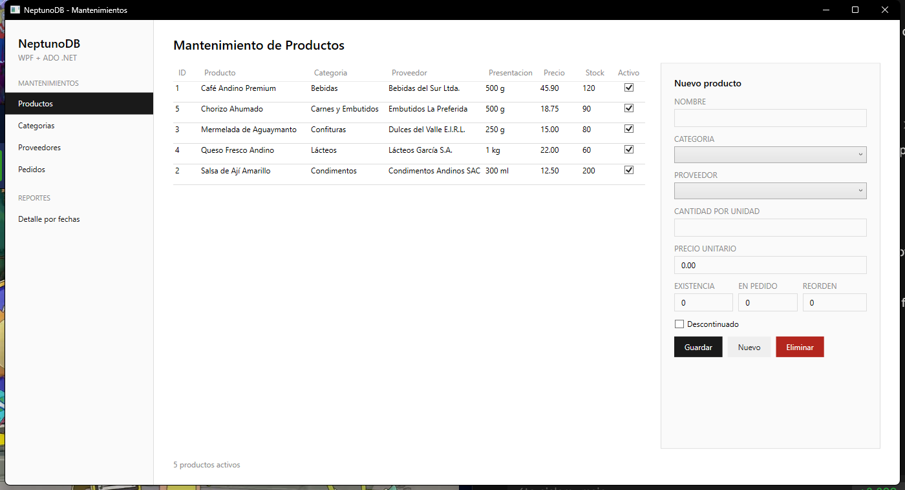 | 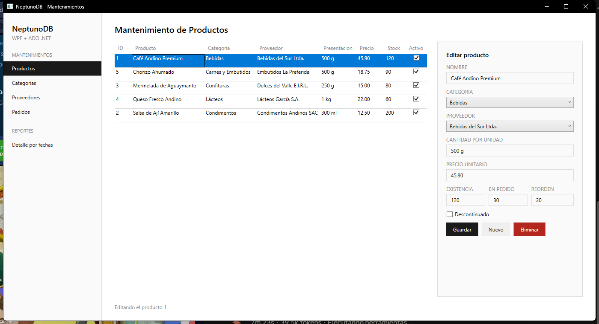 |
| Listado con los 5 productos activos | Al seleccionar una fila el formulario se carga |

| | |
|---|---|
| 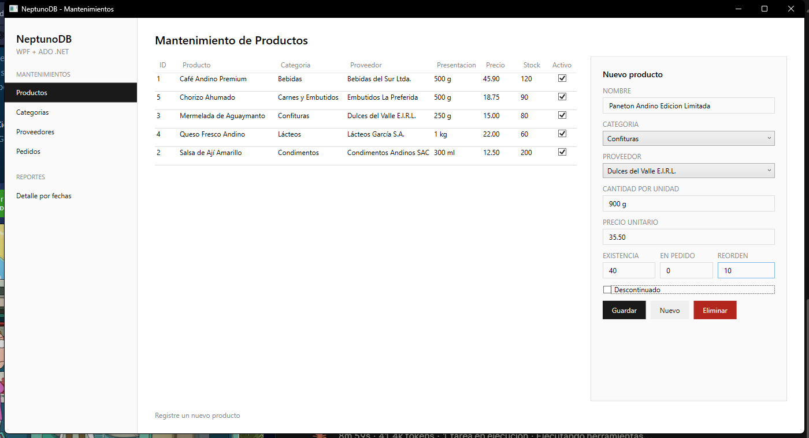 | 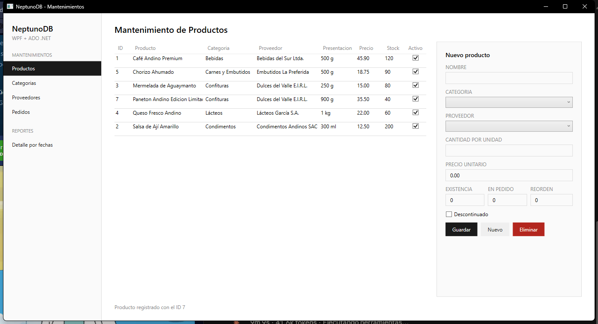 |
| Alta lista para guardar | `ExecuteNonQuery` + `@NuevoID`: *"Producto registrado con el ID 7"* |

| | |
|---|---|
| 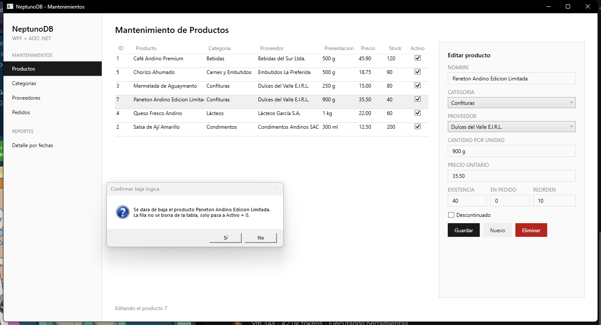 | 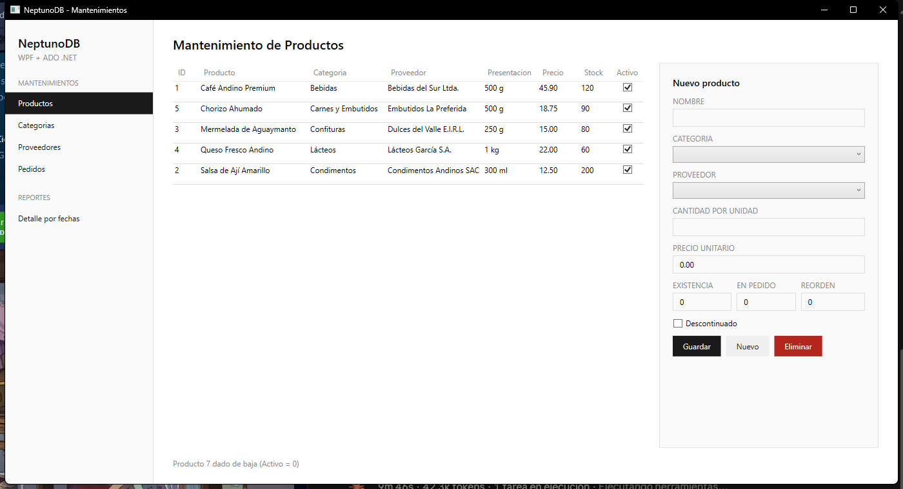 |
| El aviso aclara que la fila no se borra | *"Producto 7 dado de baja (Activo = 0)"* y desaparece del listado |

### Categorias y Proveedores

| | |
|---|---|
| 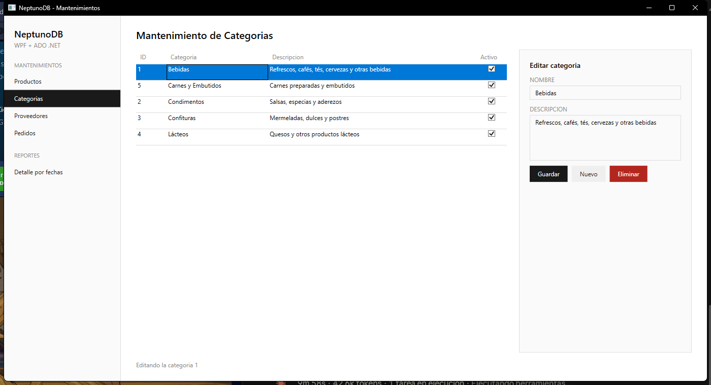 | 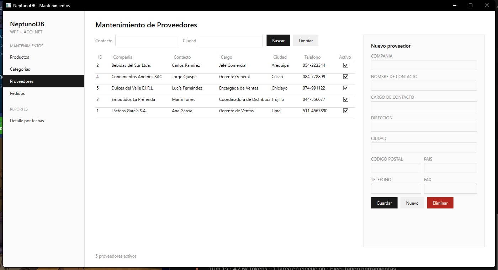 |
| Mantenimiento de categorias | Mantenimiento de proveedores |

**Punto 11.a - busqueda con filtros:**

| | |
|---|---|
| 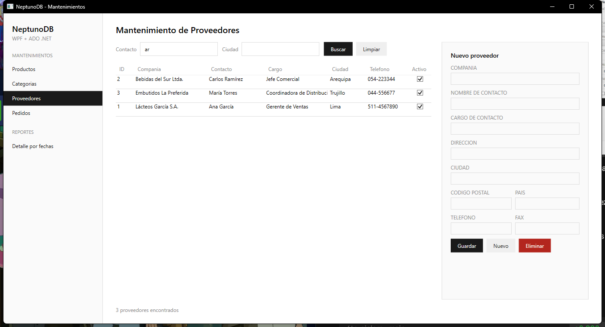 |  |
| Contacto = `ar` → 3 resultados | Contacto = `ar` + Ciudad = `Trujillo` → 1 resultado |

### Pedidos y reporte

| | |
|---|---|
| 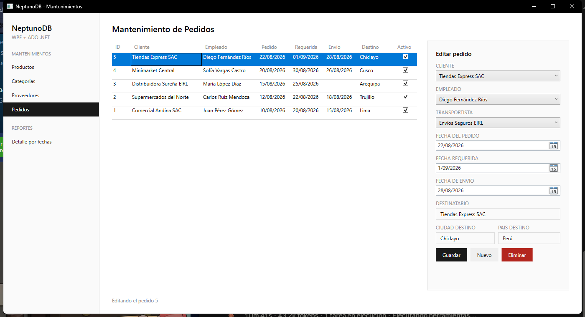 | 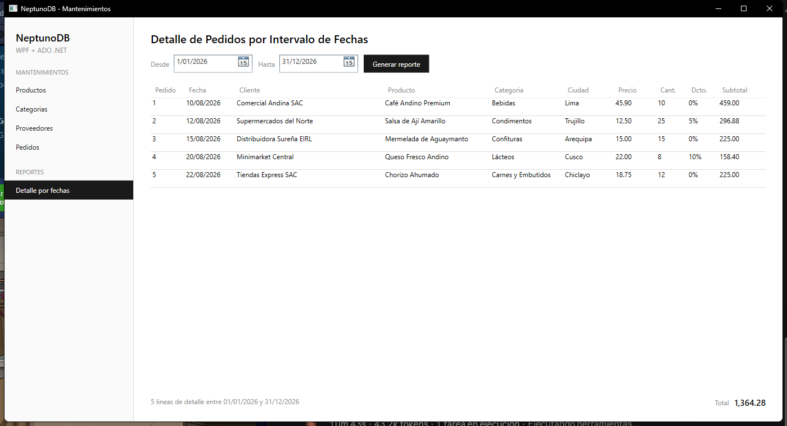 |
| Mantenimiento de pedidos | Punto 12.a: detalle por intervalo de fechas |

**Punto 8 - el reporte excluye los pedidos dados de baja:**

| | |
|---|---|
| 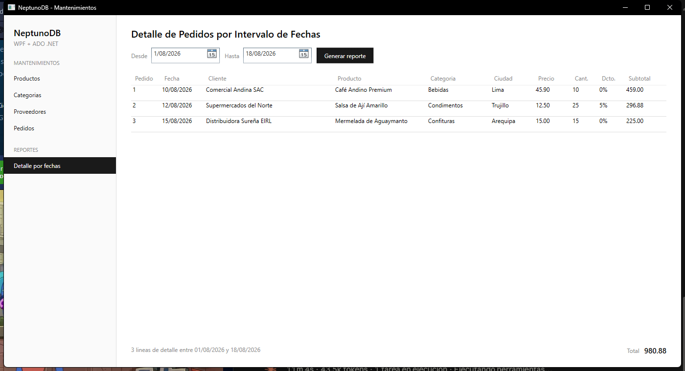 | 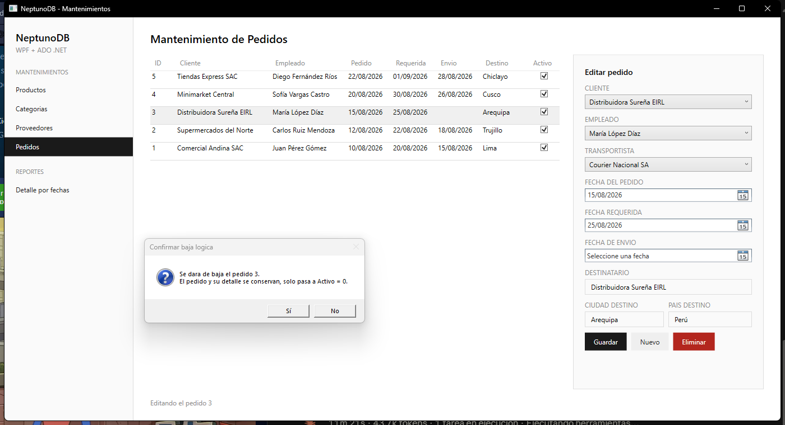 |
| 01/08 al 18/08 → 3 lineas, total **980.88** | Se da de baja el pedido 3 |

| | |
|---|---|
| 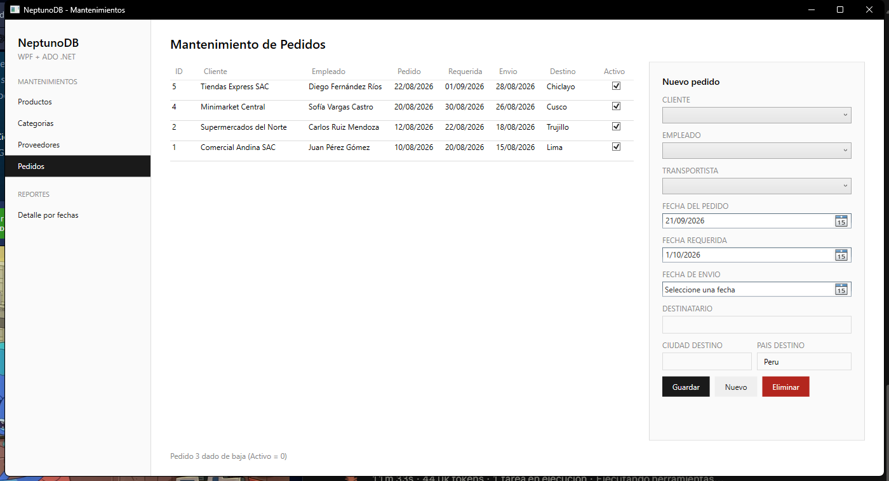 | 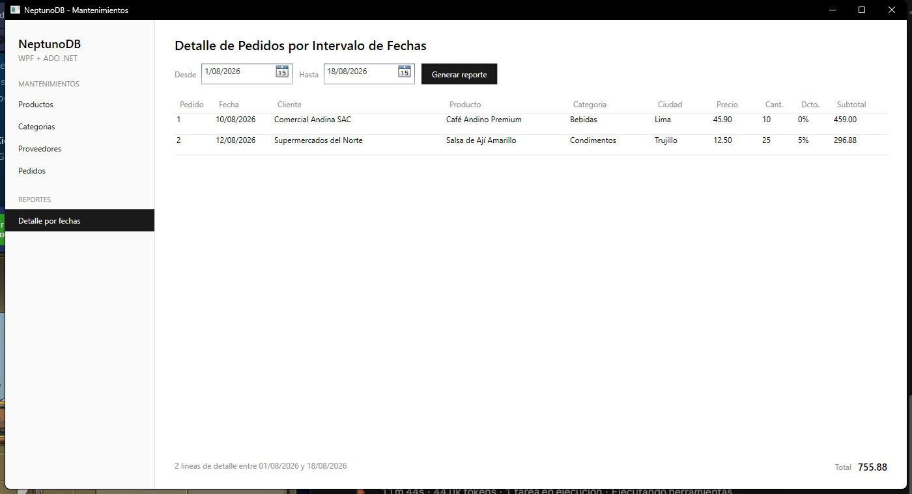 |
| El pedido 3 sale del listado | Mismo intervalo → 2 lineas, total **755.88** |

El total baja exactamente los 225.00 del pedido 3 sin que se haya borrado una sola fila.

---

## 8. Observaciones

- **El `DELETE` desaparece, el problema de integridad tambien.** `DetallePedidos` tiene
  claves foraneas hacia `Pedidos` y `Productos`. Con borrado fisico, eliminar un
  producto vendido obliga a borrar el historial de ventas o a romper la constraint. Con
  `Activo = 0` el historial se conserva completo y las FK nunca quedan colgando.

- **La bandera sola no sirve de nada.** Agregar la columna es la parte facil; lo que
  realmente implementa la baja logica es el filtro `Activo = 1` repetido en cada
  consulta. Si un solo listado se olvida del filtro, el registro "eliminado" reaparece.
  Por eso se centralizaron todas las consultas en procedimientos almacenados: el filtro
  vive en un unico lugar por entidad y la aplicacion no puede saltarselo.

- **`SET NOCOUNT ON` en un procedimiento de escritura rompe `ExecuteNonQuery`.** Devuelve
  `-1` en lugar del numero de filas. Fue una decision consciente dejarlo apagado solo en
  los procedimientos de escritura para poder distinguir una baja real de una baja que no
  afecto ningun registro.

- **Los indices filtrados traen una condicion oculta.** La primera version del script
  usaba `CREATE INDEX ... WHERE Activo = 1`. SQL Server entonces exige
  `QUOTED_IDENTIFIER ON` a **cualquier** cliente que haga `INSERT`, `UPDATE` o `DELETE`
  sobre esa tabla; `sqlcmd` se conecta con esa opcion apagada y todas las escrituras
  fallaban con el error 1934. Se cambiaron por indices normales sobre `Activo`, que
  cumplen el mismo proposito sin imponerle requisitos al cliente.

- **Los parametros de salida evitan una segunda consulta.** `SCOPE_IDENTITY()` devuelto
  por `@NuevoID OUTPUT` permite que el alta informe el ID generado usando unicamente
  `ExecuteNonQuery`, sin recurrir a `ExecuteScalar` ni a un `SELECT` adicional.

- **Los parametros tambien son la defensa contra inyeccion SQL.** Ningun valor se
  concatena dentro de una cadena SQL; todos viajan como `SqlParameter`, incluidos los
  filtros de busqueda que terminan dentro de un `LIKE`.

## 9. Conclusiones

1. La eliminacion logica se resuelve con dos piezas inseparables: el `UPDATE ... SET
   Activo = 0` en el procedimiento de baja y el `WHERE Activo = 1` en absolutamente
   todas las consultas de lectura. Implementar solo la primera deja la base en un estado
   peor que el borrado fisico, porque los registros "eliminados" siguen apareciendo.

2. `ExecuteNonQuery()` es el metodo correcto para las tres operaciones de escritura
   porque ninguna devuelve un conjunto de resultados, y su valor de retorno (las filas
   afectadas) es informacion util que la aplicacion aprovecha para dar un mensaje
   honesto al usuario en lugar de asumir que la operacion funciono.

3. Concentrar el acceso a datos en procedimientos almacenados hizo que la regla de la
   baja logica quedara del lado del servidor. La capa C# no decide si un registro esta
   vigente: solo invoca el procedimiento correspondiente, y cualquier otro cliente que
   se conecte a NeptunoDB obtiene el mismo comportamiento.

4. Separar el proyecto en Models, Data, ViewModels y Views permitio que las cuatro
   entidades compartieran exactamente el mismo patron. Agregar un quinto mantenimiento
   seria mecanico: un modelo, un repositorio con las mismas cuatro operaciones, un
   viewmodel y una vista.

5. Probar contra la base real, y no solo contra la interfaz, fue lo que dio la certeza
   de que la baja es logica: consultar la tabla directamente y ver la fila con
   `Activo = 0` mientras el listado devuelve un registro menos es la evidencia que
   ninguna captura de pantalla por si sola puede dar.
